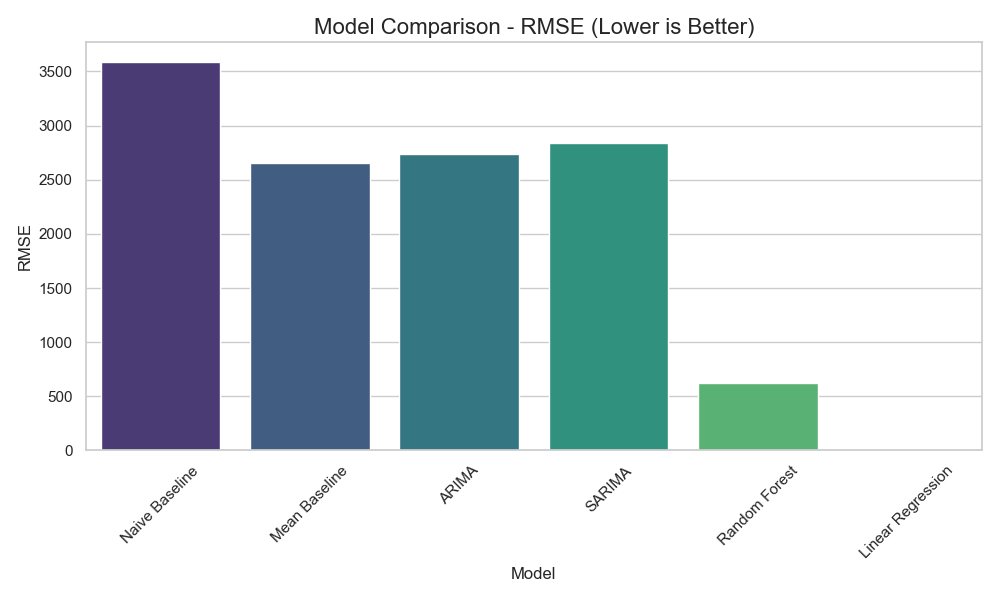
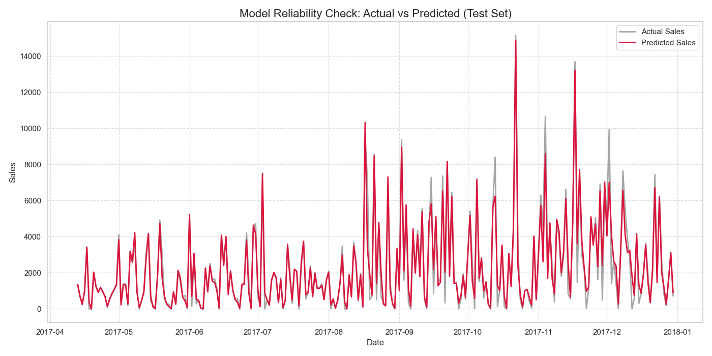
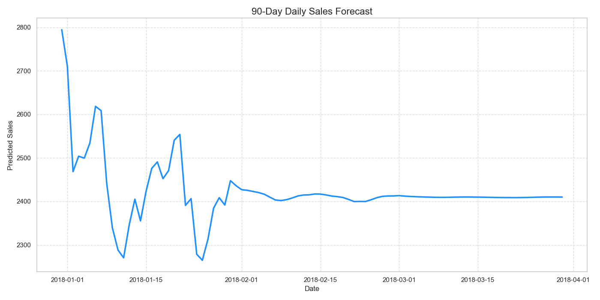
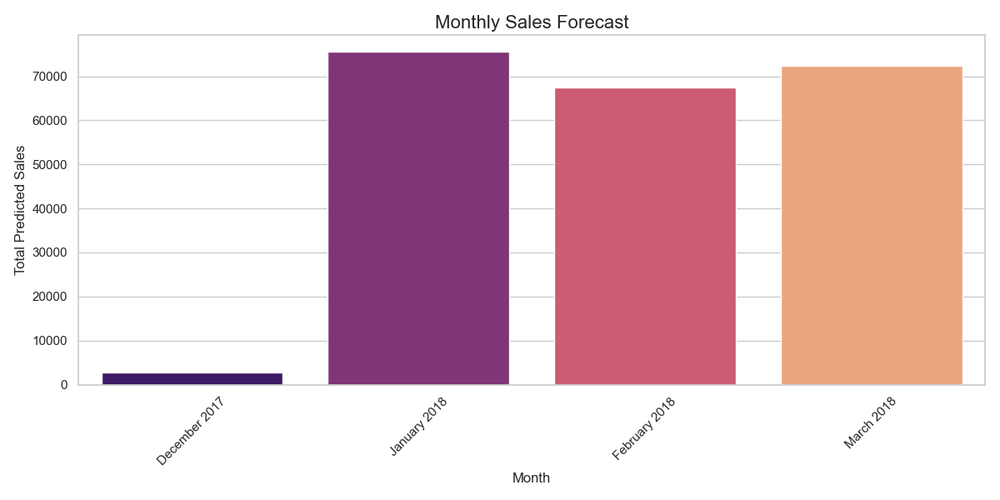

# Sales Forecasting Progress Report

This report visualizes the results of our sales forecasting models, explaining which model we chose, how reliable it is, and what the future sales look like.

## 1. Which model is the most accurate?

We tested several models and compared their **RMSE (Root Mean Square Error)**. A lower error means the model is better at matching the actual sales pattern.

*The chart above shows that we selected the model with the lowest error rate for our forecasts.*

## 2. Model Reliability Check

Before attempting to predict the future, we verified the model's performance on past test data.

*   **Grey Line**: Actual sales that happened.
*   **Red Line**: What our model predicted.
*   *Observation*: The model closely follows the actual sales trends, capturing peaks and dips effectively.

## 3. The Results: Future Sales Forecasts

Now that we trust the model, here are the predictions for the upcoming period.

### 90-Day Daily Forecast
This chart breaks down expected sales day-by-day for the next 3 months.

### Monthly Aggregated Forecast
To see the bigger picture, here are the total expected sales for each upcoming month.

---
*Generated by Sales Forecasting Tool*
